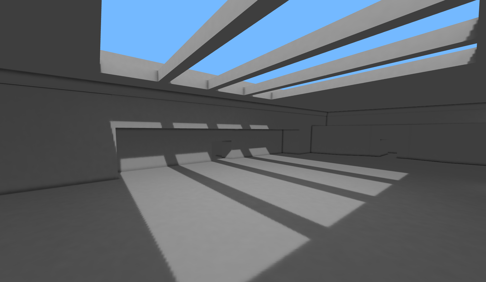
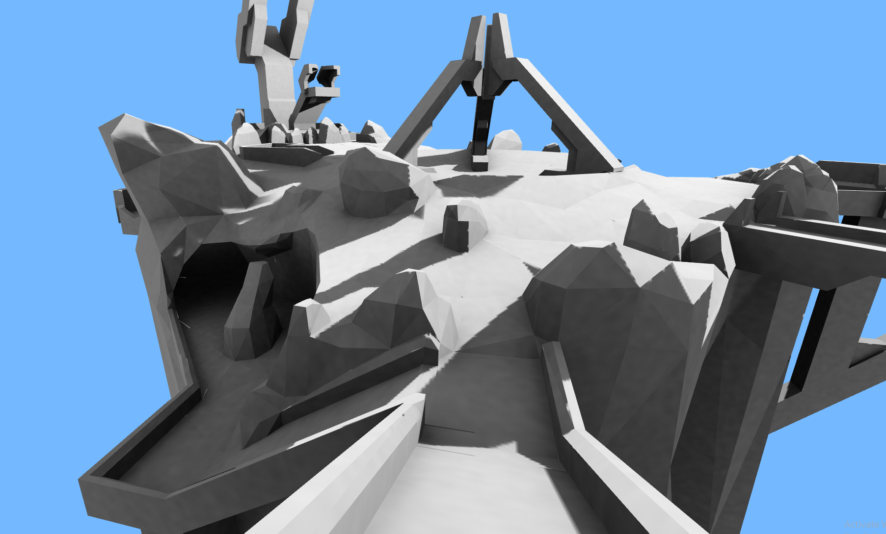
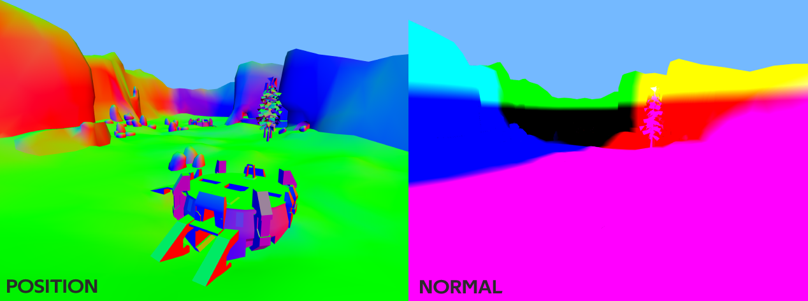
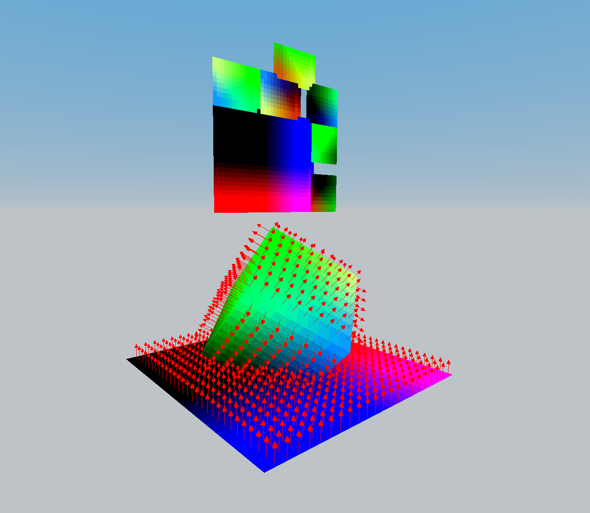

# 🍞 Three Lightmap Baker

<h4 align="center">Basic example of lightmapping in ThreeJS</h4>
<h4 align="center">✨ Big Thanks for <a href="https://github.com/gkjohnson/three-mesh-bvh">Three Mesh BVH</a> & <a href="https://github.com/gkjohnson/three-gpu-pathtracer">Three GPU Pathtracer</a> for been excellent libraries ✨</h4>

 
## Todo
 - High casts can cause the WebGL context to timeout
 - Export models & lightmaps
 - Bounce lighting
 - Albedo & Emissive textures
 - Only denoise indirect light & AO
 - Denoise offline (using Optix)
 - Try import/use more GPU Pathtracer logic
 - Multiple lights, light types, light colour
 - Remove copyrighted maps...

## Examples

## How it works
1. We pass all the geomerty we want to lightbake into XAtlas. This will generate us a shared UV2 attribute.
2. We then render the UVs to two textures (texture resolution being the lightmap resolution). **World Position map** & **Normal map**

**Visual reference:** When using these textures as the lightmap (using UV2). 

3. We've effectivly split the map up into a pixel grid. We have both the world position & normal of each "pixel".
4. This is useful as we can then cast rays from each one of the pixels world position in a hemisphere in the direction of the normal and calculate how much light that "pixel" receives. 

**Visual reference:** Creating arrows for each world positon & the normal

5. Using the Three Mesh BVH library we can generate a BVH Mesh to speed up the raycasting. It also supports casting the rays on the GPU via a shader (this is super fast). Using A LOT of copy & pasted code from Three GPU Pathtracer we can simulate light!

## Further Reading / Watching
 - [I made a better Ray-Tracing engine](https://www.youtube.com/watch?v=A61S_2swwAc)
 - [High level overview of a lightmapping generation process](https://www.reddit.com/r/GraphicsProgramming/comments/brl22k/high_level_overview_of_a_lightmapping_generation/)
 - [Baking artifact-free lightmaps on the GPU](https://ndotl.wordpress.com/2018/08/29/baking-artifact-free-lightmaps/)
 - [Radiosity Baker](http://david-westreicher.github.io/2014/05/31/radiosity/)