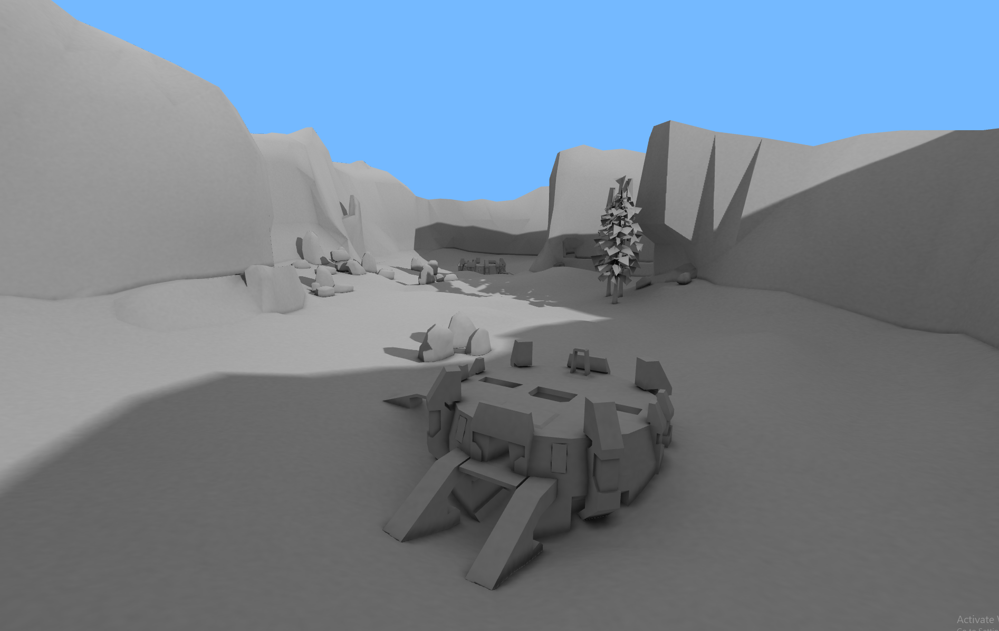
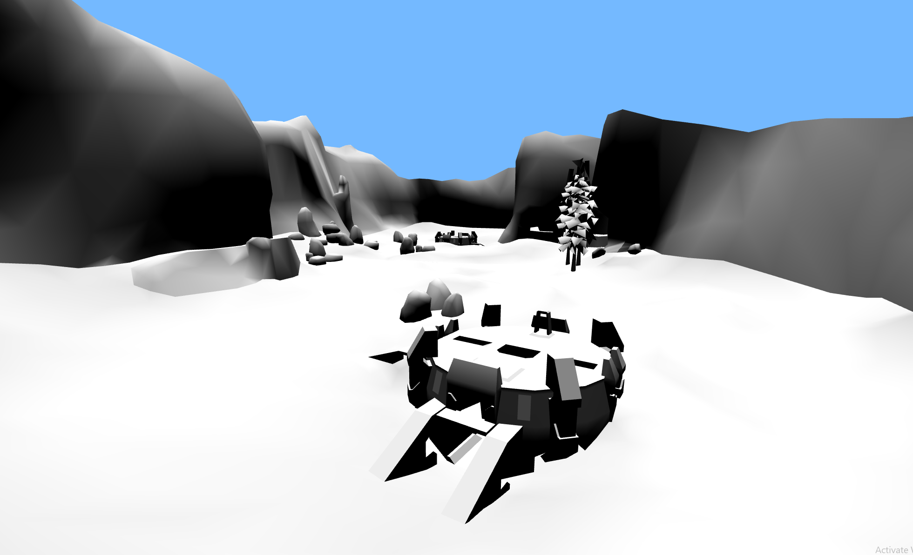
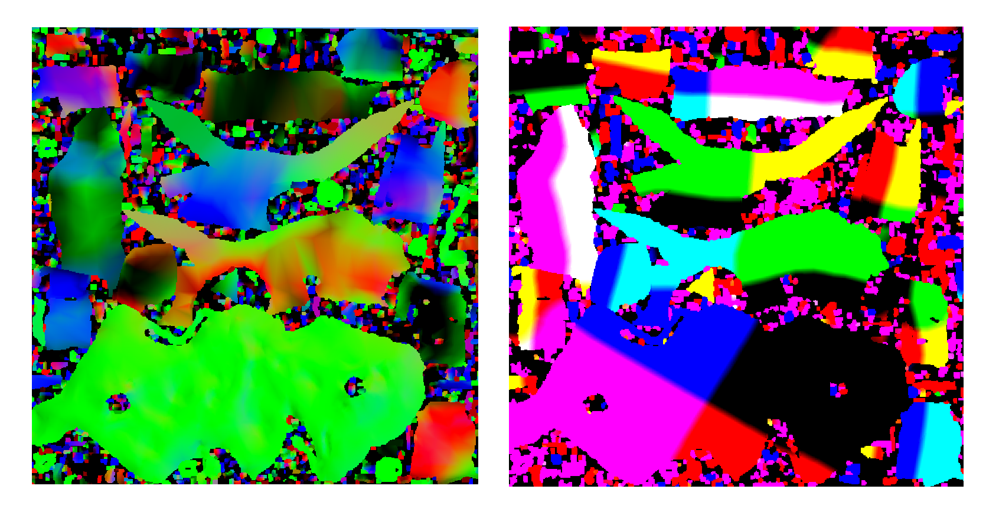
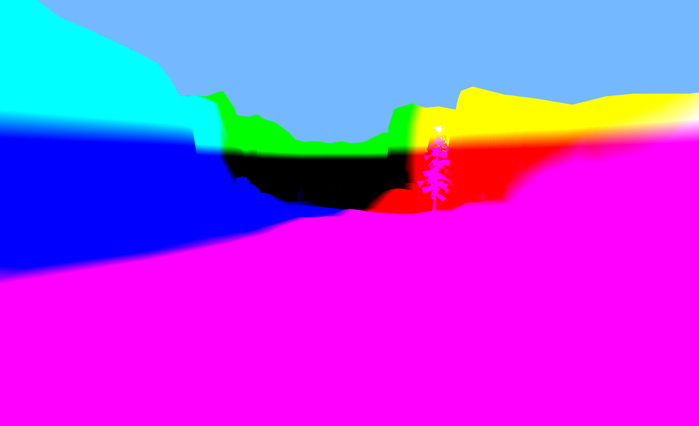
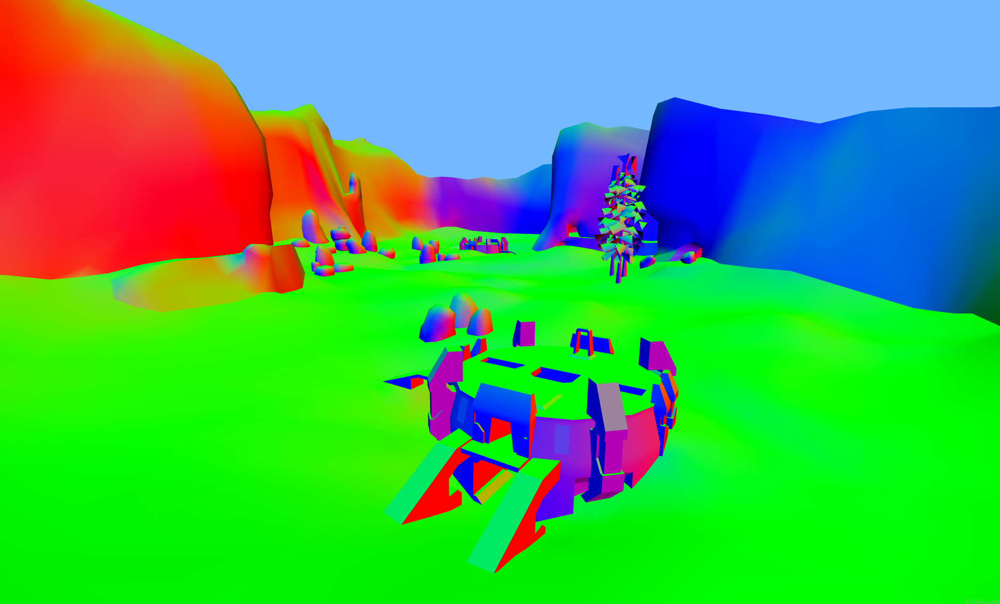
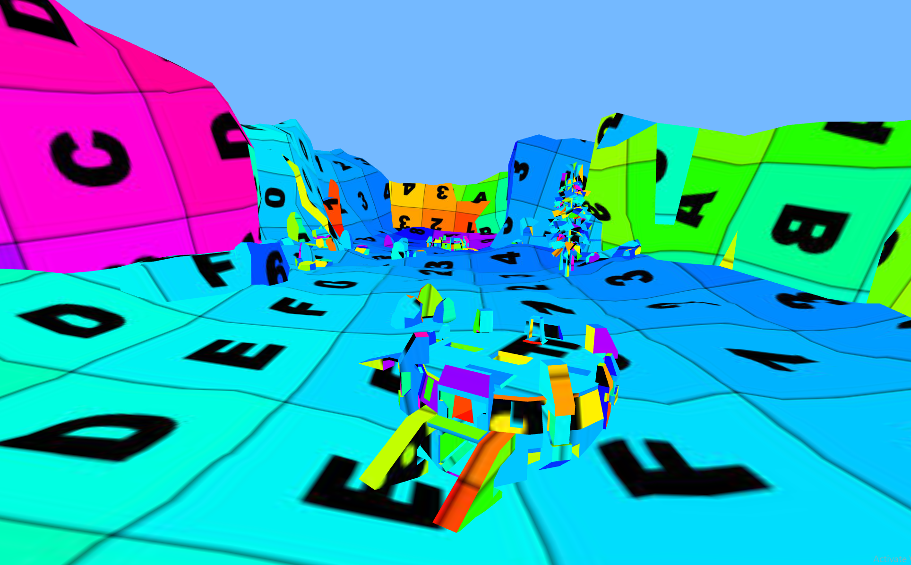

# 🍞 Three Lightmap Baker

✨ Big Thanks for [Three Mesh BVH](https://github.com/gkjohnson/three-mesh-bvh) & [Three GPU Pathtracer](https://github.com/gkjohnson/three-gpu-pathtracer) to make this possible

 - Basic example of lightmapping in ThreeJS

 - Render lightmap over multiple frames (currently can lose GL context if too complex)
 - Export models & lightmaps
 - Bounce lighting
 - Only denoise indirect light & AO
 - Denoise offline (using Optix)
 - Try import/use more GPU Pathtracer logic
 

## Examples

## How it works

